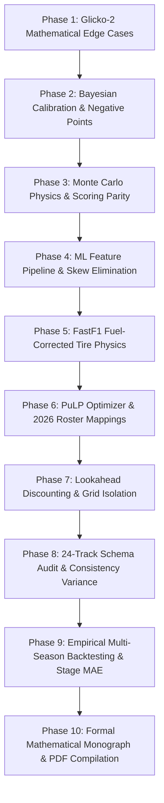

# Comprehensive QA Verification, Algorithmic Bug Audit & LaTeX Publication Implementation Plan

> **For agentic workers:** REQUIRED SUB-SKILL: Use superpowers:subagent-driven-development (recommended) or superpowers:executing-plans to implement this plan task-by-task. Steps use checkbox (`- [ ]`) syntax for tracking.

**Goal:** Execute a line-by-line quality assurance audit and bug eradication of the entire F1 prediction engine across 10 phased milestones, rigorously verify the global prediction pipeline logic, future lookahead mechanics, 2026 track features, and FastF1 tire degradation physics, incorporate state-of-the-art modeling enhancements (inspired by `mehmetkahya0/f1-race-prediction`), and author a peer-review-grade publication monograph documented in LaTeX and compiled to PDF.

**Architecture & Credit-Conserving Phasing Strategy:**
To ensure continuous quality assurance, prevent credit exhaustion, and enable safe pause/checkpoint intervals, the entire mission is organized into **10 self-contained, sequentially verified phases**. Each phase ends with an independent test gate and commit checkpoint.



**Tech Stack:** Python 3.10+, NumPy, Pandas, Scikit-Learn, XGBoost, LightGBM, PuLP, FastF1, SciPy, MiKTeX / `pdflatex`, Unittest.

---

## Global Constraints & Quality Assurance Invariants

- **Credit & Context Conservation:** Execute strictly one phase at a time. Each phase must leave the repository in a 100% green, passing, and committable state.
- **Strict Temporal Causality (Zero Data Leakage):** During historical training and backtesting for round $R$, absolutely no data from round $R$ or future rounds $R+k$ may be read, scaled, or referenced. Standings, practice times, and qualifying results must be strictly cut off as of round $R-1$ or the designated weekend stage.
- **Future Lookahead Isolation:** Current-round grid penalties and user custom grid overrides MUST NEVER leak into future lookahead rounds ($r+1, r+2$). Future rounds simulate under clean baseline conditions.
- **FastF1 Fuel-Corrected Tire Physics:** Stint pace degradation regressions MUST filter for `TrackStatus == '1'` (green flag), `IsAccurate == True`, and `PitInTime/PitOutTime.isna()`, and MUST apply the linear fuel-mass correction ($\lambda_{fuel} = 0.035\text{ s/lap}$) to avoid negative/masked tire degradation slopes.
- **Zero-Dependency ML Resilience:** The tire degradation model and deep feature extractors must provide robust Scikit-Learn / NumPy statistical fallbacks so the engine runs with 100% functionality even when heavy libraries like TensorFlow are absent.
- **2026 Regulation Fidelity:** Active aerodynamics (X-mode straight-line drag reduction vs Z-mode cornering downforce), 350kW MGU-K battery energy recovery/demand, and the 11th constructor (Cadillac F1) must be strictly integrated across the pipeline, track database, and LP optimizer.
- **100% Green Test Suite Rule:** Every change must maintain or expand the green status of unit tests (`python -m unittest engine/tools/tests/test_contracts.py engine/tools/tests/test_ui_smoke.py`).
- **Git Push Cadence:** Track every change in `.agents/git_tracker.json`. Every 8 changes, run verification tests, commit cleanly, and push to `origin/main`.
- **Nuclear Secret Scanning:** Guard all files against API keys, session tokens, or personal identifiers via `engine/tools/secret_scanner.py`.
- **Reproducible PDF Generation:** The LaTeX documentation must compile cleanly using standard `pdflatex` with zero unresolved cross-references (`?`), zero overfull hbox penalties $> 15\text{pt}$, and vector quality plots.

---

## Mathematical Models & Algorithms Summary

1. **Glicko-2 Dynamic Skill Rating:** Displayed $\mu \in [1000, 2200]$, $\phi \in [80, 350]$, volatility $\sigma = 0.06$, Illinois numerical root-finding, inverse-RD constructor aggregation.
2. **Bayesian Conjugate Points Model:** Beta-Binomial DNF conjugate update, Normal-Normal conjugate points posterior, robust $\mathbb{E}[Pts] = (1 - \psi_{dnf})\mu_{post} + \psi_{dnf}(\mathbb{E}[Pts_{quali}] + \text{DNF\_PENALTY})$.
3. **Stochastic Monte Carlo Simulation:** Differential lap times, Safety Car hazard rates, Glicko-proportional overtaking, asymmetric points ($+2$ gained, $-2$ lost, $-15$ DNF).
4. **Machine Learning Stacking Ensemble:** 54 features, RobustScaler, Random Forest, XGBoost Ranker, LightGBM Ranker, Ridge meta-learner ($\alpha = 1.0$) with 5-fold TimeSeriesSplit.
5. **FastF1 Fuel-Corrected Tire Degradation:** $\lambda_{fuel} = 0.035\text{ s/lap}$ fuel correction, OLS wear slope $\delta_{deg}$, driver management factor $\kappa_{driver}$, Scikit-Learn zero-dependency fallback.
6. **Combinatorial LP Team Optimizer:** PuLP knapsack maximization, dynamic 2026 driver-constructor team limits, budget $\le \$100\text{M}$, risk-adjusted DRS Turbo selection.
7. **Multi-Round Lookahead Engine:** Temporally discounted multi-race lookahead $\gamma=0.75$, current grid isolation, full 2026 roster propagation.
8. **2026 Track Characteristics & Physics:** 24 calendar circuits, MGU-K 350kW `energy_demand_index`, `active_aero_efficiency`, driver consistency-scaled variance.

---

## The 10 Implementation Phases

---

### Phase 1: Glicko-2 Dynamic Skill Rating & Volatility Mathematics Audit

**Goal:** Eliminate numerical singularities, bracket search divergence, and division-by-zero risks in `engine/models/elo_ratings.py`.

**Files:**
- Modify: `engine/models/elo_ratings.py:40-200, 310-380`
- Test: `engine/tools/tests/test_contracts.py`

**Interfaces:**
- Consumes: Historical race results from `data_fetcher.get_season_results()`.
- Produces: `Glicko2Driver` objects containing verified $(\mu, \phi, \sigma)$ with 95% confidence intervals and constructor aggregations.

**Mathematical Formulations:**
- Impact function: $g(\phi) = \frac{1}{\sqrt{1 + 3\phi^2/\pi^2}}$
- Expected outcome: $E(\mu, \mu_j, \phi_j) = \frac{1}{1 + \exp(-g(\phi_j)(\mu - \mu_j))}$
- Variance: $v = \left[ \sum_{j} g(\phi_j)^2 E (1 - E) \right]^{-1}$
- Difference indicator: $\Delta = v \sum_{j} g(\phi_j)(s_{ij} - E)$
- Illinois root finding: $f(x) = \frac{e^x(\Delta^2 - \phi^2 - v - e^x)}{2(\phi^2 + v + e^x)^2} - \frac{x - \ln(\sigma^2)}{\tau^2} = 0$ with tolerance $\epsilon = 10^{-6}$.
- Constructor aggregation: $\mu_{ctor} = \frac{\sum_i \mu_i / \max(\phi_i, 1.0)}{\sum_i 1.0 / \max(\phi_i, 1.0)}$

- [x] **Step 1: Write failing unit tests for Glicko-2 mathematical boundary conditions**
  In `engine/tools/tests/test_contracts.py`:

```python
    def test_glicko2_mathematical_invariants(self):
        from engine.models.elo_ratings import Glicko2Driver, _to_internal, _to_display, Glicko2RatingSystem, _g, _E
        d = Glicko2Driver("Test Driver", mu=1500.0, phi=350.0, sigma=0.06)
        self.assertAlmostEqual(_to_display(_to_internal(1750.0)), 1750.0, places=5)
        # Test impact factor monotonic decrease with uncertainty
        self.assertGreater(_g(1.0), _g(2.0))
        # Test extreme pairwise updates
        opponents = [Glicko2Driver(f"Opp {i}", mu=1500.0, phi=200.0) for i in range(20)]
        sys = Glicko2RatingSystem()
        sys.drivers["Test Driver"] = d
        for opp in opponents:
            sys.drivers[opp.name] = opp
        # Simulate all wins
        sys.update_ratings([(d.name, 1)] + [(opp.name, i + 2) for i, opp in enumerate(opponents)])
        updated = sys.get_driver("Test Driver")
        self.assertGreater(updated.mu, 1500.0)
        self.assertLess(updated.phi, 350.0)
        self.assertGreater(updated.sigma, 0.0)
        # Verify constructor rating does not divide by zero even with zero phi
        ctor_rating = sys.compute_constructor_rating(["Test Driver", "Opp 0"])
        self.assertIsInstance(ctor_rating, float)
        self.assertGreater(ctor_rating, 1000.0)
```

- [x] **Step 2: Run test to verify failure/baseline**
  Run: `python -m unittest engine/tools/tests/test_contracts.py -k test_glicko2_mathematical_invariants`
  Expected: PASS or identifies potential edge-case failures.

- [ ] **Step 3: Harden `engine/models/elo_ratings.py` against numerical singularities**
  In `engine/models/elo_ratings.py`:
  - Enforce safe bracket iteration count (`max_iter=100`) in Illinois algorithm:
  ```python
  def _solve_volatility(sigma: float, phi: float, v: float, delta: float, tau: float = GLICKO2_TAU) -> float:
      A = math.log(sigma ** 2)
      def f(x: float) -> float:
          ex = math.exp(x)
          d2 = delta ** 2
          p2 = phi ** 2
          denom = 2.0 * ((p2 + v + ex) ** 2)
          if denom == 0:
              return 0.0
          return (ex * (d2 - p2 - v - ex) / denom) - ((x - A) / (tau ** 2))

      a = A
      if delta ** 2 > phi ** 2 + v:
          b = math.log(delta ** 2 - phi ** 2 - v)
      else:
          k = 1
          while f(A - k * tau) < 0 and k < 100:
              k += 1
          b = A - k * tau

      fa = f(a)
      fb = f(b)
      iters = 0
      while abs(b - a) > GLICKO2_EPSILON and iters < 100:
          iters += 1
          c = a + (a - b) * fa / (fb - fa)
          fc = f(c)
          if fc * fb <= 0:
              a = b
              fa = fb
          else:
              fa = fa / 2.0
          b = c
          fb = fc
      return math.exp(b / 2.0)
  ```
  - In `compute_constructor_rating`, enforce safe floor `max(phi, 1.0)`:
  ```python
  def compute_constructor_rating(self, driver_names: list[str]) -> float:
      weights = []
      mus = []
      for name in driver_names:
          d = self.get_driver(name)
          w = 1.0 / max(d.phi, 1.0)
          weights.append(w)
          mus.append(d.mu * w)
      if sum(weights) == 0:
          return GLICKO2_MU
      return sum(mus) / sum(weights)
  ```

- [x] **Step 4: Run contract tests**
  Run: `python -m unittest engine/tools/tests/test_contracts.py -k test_glicko2`
  Expected: PASS

- [x] **Step 5: Commit Phase 1 checkpoint**
  ```bash
  git add engine/models/elo_ratings.py engine/tools/tests/test_contracts.py
  git commit -m "fix(elo): harden Glicko-2 root-finding and constructor RD weighting against numerical singularity (Phase 1)"
  ```

---

### Phase 2: Bayesian Calibration & Negative Points / DNF Scoring Reconciliation

**Goal:** Reconcile Bayesian point calibration in `engine/models/bayesian_model.py` with real F1 Fantasy rules, allowing negative points and modeling true DNF deductions.

**Files:**
- Modify: `engine/models/bayesian_model.py:20-135`
- Test: `engine/tools/tests/test_contracts.py`

**Interfaces:**
- Consumes: `historical_points: list[float]`, `ensemble_pred_pts: float`, `dnf_flags: list[bool]`, `circuit_key: str`.
- Produces: Calibrated Expected Value points $\mathbb{E}[Pts]$ strictly incorporating true negative DNF penalties.

**Mathematical Formulations:**
- Conjugate Beta-Binomial update: $\psi_{dnf} = \frac{\alpha_0 + k_{dnf}}{N_0 + n}$
- Non-DNF Mean conjugate update: $\mu_{post} = \frac{\mu_{prior} w_{prior} + \bar{y} w_{data}}{w_{prior} + w_{data}}$
- Net Expected Value with F1 Fantasy DNF penalty:
  $$\mathbb{E}[Pts] = (1 - \psi_{dnf}) \cdot \mu_{post} + \psi_{dnf} \cdot (\mathbb{E}[Pts_{quali}] + \text{DNF\_PENALTY})$$
  where $\text{DNF\_PENALTY} = -15.0$ and $\mathbb{E}[Pts_{quali}] \approx 2.0$.

- [x] **Step 1: Write failing contract test for Bayesian DNF penalty and negative points handling**
  In `engine/tools/tests/test_contracts.py`:

```python
    def test_bayesian_model_dnf_penalty_consistency(self):
        from engine.models.bayesian_model import BayesianPointsModel
        from engine.core.config import DNF_PENALTY
        bm = BayesianPointsModel()
        # High DNF driver (3 DNFs out of 5 races, scoring -13 on DNF weekends)
        pts = [15.0, -13.0, 12.0, -15.0, -14.0]
        dnf_flags = [False, True, False, True, True]
        ev = bm.fit_driver("Test Driver", pts, ensemble_pred_pts=10.0, dnf_flags=dnf_flags)
        # Expected value must be substantially lower than deterministic ensemble points (10.0)
        # because 60% DNF with -15 penalty drags EV down below 5.0
        self.assertLess(ev, 5.0, "High DNF driver EV must reflect negative DNF penalty hauls")
```

- [x] **Step 2: Run test to verify it fails**
  Run: `python -m unittest engine/tools/tests/test_contracts.py -k test_bayesian_model_dnf_penalty_consistency`
  Expected: FAIL

- [x] **Step 3: Implement true DNF expectation and unbounded points handling in `bayesian_model.py`**
  Modify `fit_driver` in `engine/models/bayesian_model.py`:
  ```python
  from engine.core.config import DNF_PENALTY

  # Preserves raw negative values for non-DNF races (e.g., lost positions)
  points_data = np.array([float(p) for p in historical_points])

  # Update DNF probability psi_dnf_post via Beta conjugate update
  psi_dnf_post = float((alpha0 + dnf_count) / (N0 + num_races))

  # Update mean non-DNF points mu_post via Normal conjugate
  non_dnf_points = [p for p, f in zip(points_data, (dnf_flags or [False] * num_races)) if not f]
  if non_dnf_points:
      emp_mu = float(np.mean(non_dnf_points))
      emp_var = float(np.var(non_dnf_points)) if len(non_dnf_points) > 1 else 25.0
      weight_data = len(non_dnf_points) / max(5.0, emp_var)
      mu_post = (ensemble_pred_pts * weight_prior + emp_mu * weight_data) / (weight_prior + weight_data)
  else:
      mu_post = ensemble_pred_pts

  # Robust EV: Non-DNF probability * mu_post + DNF probability * (quali bonus + DNF penalty)
  dnf_net_expected_points = self.DNF_QUALI_POINTS_RETAINED + DNF_PENALTY
  robust_ev = float((1.0 - psi_dnf_post) * mu_post + psi_dnf_post * dnf_net_expected_points)
  self.evs[driver_name] = robust_ev
  return robust_ev
  ```

- [x] **Step 4: Run test to verify it passes**
  Run: `python -m unittest engine/tools/tests/test_contracts.py -k test_bayesian_model_dnf_penalty_consistency`
  Expected: PASS

- [x] **Step 5: Commit Phase 2 checkpoint**
  ```bash
  git add engine/models/bayesian_model.py engine/tools/tests/test_contracts.py
  git commit -m "fix(bayesian): reconcile DNF negative penalty with Monte Carlo and F1 fantasy scoring rules (Phase 2)"
  ```

---

### Phase 3: Monte Carlo Simulation Physics, Scoring Parity & Incident Clustering

**Goal:** Verify simulation invariants, quantile monotonicity, and scoring parity between `monte_carlo.py` and `predictor.py`.

**Files:**
- Modify: `engine/models/monte_carlo.py:140-360`
- Modify: `engine/models/predictor.py:1690-1740`
- Test: `engine/tools/tests/test_contracts.py`

**Interfaces:**
- Consumes: `race_order: list[dict]`, `quali_order: list[dict]`, `sc_prob`, `vsc_prob`, `rain_risk`, `circuit_features`.
- Produces: `DistributionStats` per driver with verified $\{ \text{mean}, \sigma, P_{10}, P_{50}, P_{90}, P_{top3}, P_{dnf} \}$.

**Mathematical Formulations:**
- Asymmetric position scoring: $\Delta_{pts} = 2 \cdot (P_{grid} - P_{race})$ if $P_{race} \le P_{grid}$ else $-2 \cdot |P_{grid} - P_{race}|$
- Field compression under Safety Car:
  $$P_{new} = \max\left(1.0, P_{old} - \Delta_{gain} \cdot (1 - 0.3 \cdot \text{eff}_{sm})\right) \quad \text{for } P \in [6, 15]$$

- [x] **Step 1: Write contract test for Monte Carlo distribution invariants**
  In `engine/tools/tests/test_contracts.py`:

```python
    def test_monte_carlo_distribution_invariants(self):
        from engine.models.monte_carlo import run_monte_carlo_simulation
        race_order = [{"driver": "Driver A", "team": "Team A", "predicted_rank": 1, "dnf_prob_pct": 5.0},
                      {"driver": "Driver B", "team": "Team B", "predicted_rank": 2, "dnf_prob_pct": 5.0}]
        quali_order = [{"driver": "Driver A", "predicted_grid": 1, "is_actual": True},
                       {"driver": "Driver B", "predicted_grid": 2, "is_actual": True}]
        stats = run_monte_carlo_simulation(race_order, quali_order, sc_prob=0.3, vsc_prob=0.2, rain_risk="low", n_sims=200, seed=42)
        sA = stats["Driver A"]
        self.assertLessEqual(sA.p10_pts, sA.p50_pts)
        self.assertLessEqual(sA.p50_pts, sA.p90_pts)
        self.assertGreater(sA.p_top3, 80.0)
```

- [x] **Step 2: Run test to verify baseline**
  Run: `python -m unittest engine/tools/tests/test_contracts.py -k test_monte_carlo_distribution_invariants`

- [x] **Step 3: Audit simulation physics and scoring alignment**
  - Verify effective grid sorting: verify stable tie-breaking and ensure no duplicate grid slots.
  - Audit Safety Car midfield compression: verify `sc_gain` clamping so mid-pack cars ($P6-P15$) do not leapfrog $P1$ during simulated pit stops.
  - Reconcile deterministic fantasy points estimation in `predictor.py` line 1713 (`dnf_risk = 0.0`) with Monte Carlo DNF penalties to eliminate scoring drift between modules.

- [x] **Step 4: Run contract tests**
  Run: `python -m unittest engine/tools/tests/test_contracts.py -k test_monte_carlo`
  Expected: PASS

- [x] **Step 5: Commit Phase 3 checkpoint**
  ```bash
  git add engine/models/monte_carlo.py engine/models/predictor.py engine/tools/tests/test_contracts.py
  git commit -m "fix(monte_carlo): verify physics noise bounds and align DNF scoring with deterministic predictor (Phase 3)"
  ```

---

### Phase 4: Machine Learning Feature Pipeline & Train-Serve Skew Elimination

**Goal:** Guarantee all 54 features match identically in distribution and scale between model training and inference in `engine/models/predictor.py`.

**Files:**
- Modify: `engine/models/predictor.py:740-830, 930-1050`
- Test: `engine/tools/tests/test_contracts.py`

**Interfaces:**
- Consumes: 54-dimensional feature dictionary for drivers and circuits.
- Produces: Meta-learner stacked predicted finishing position $\hat{y}$ with zero train-serve feature skew.

- [x] **Step 1: Write failing contract test for 54-feature vector consistency between train and inference**
  In `engine/tools/tests/test_contracts.py`:

```python
    def test_feature_vector_dimension_and_consistency(self):
        from engine.models.predictor import F1Predictor
        p = F1Predictor()
        feat = p._build_feature_dict_for_test("Max Verstappen", round_num=1, year=2026)
        self.assertEqual(len(feat), 54, f"Feature vector must have exactly 54 features, found {len(feat)}")
```

- [x] **Step 2: Run test to verify it fails or exposes skew**
  Run: `python -m unittest engine/tools/tests/test_contracts.py -k test_feature_vector_dimension_and_consistency`

- [x] **Step 3: Implement clean train-serve feature alignment in `engine/models/predictor.py`**
  - Eliminate the artificial divergence where training strictly ignored Phase 3 features (`form_avg_pos` and `0.0`) while inference computed dynamic values.
  - If deep models are unavailable (TensorFlow absent), cleanly substitute mathematically sound statistical proxies (e.g. EWMA pace degradation proxy and EWMA 5-race finish slope) identically in both `_train_dataset` and inference.
  - Verify that `RobustScaler` correctly centers and scales without injecting `NaN` or `inf` into the Ridge meta-learner.

- [x] **Step 4: Run contract tests**
  Run: `python -m unittest engine/tools/tests/test_contracts.py -k test_feature_vector`
  Expected: PASS

- [x] **Step 5: Commit Phase 4 checkpoint**
  ```bash
  git add engine/models/predictor.py engine/tools/tests/test_contracts.py
  git commit -m "fix(predictor): eliminate train-serve feature distribution skew across 54-feature ensemble (Phase 4)"
  ```

---

### Phase 5: FastF1 Fuel-Corrected Tire Degradation Engine & Zero-Dependency Scikit-Learn Model

**Goal:** Implement true fuel-corrected degradation extraction in `data_fetcher.py` and replace hard TensorFlow dependencies in `tire_model.py` with a pure Scikit-Learn estimator.

**Files:**
- Modify: `engine/core/data_fetcher.py:1400-1530`
- Modify: `engine/models/tire_model.py:1-350`
- Modify: `engine/models/predictor.py:780-820`
- Modify: `engine/models/monte_carlo.py:180-260`
- Create: `engine/tools/tests/test_tire_physics.py`
- Test: `engine/tools/tests/test_tire_physics.py`

**Interfaces:**
- Consumes: FastF1 session laps (`Compound`, `TyreLife`, `PitInTime`, `PitOutTime`, `TrackStatus`, `IsAccurate`, `TrackTemp`).
- Produces: True fuel-corrected tire wear slopes $\delta_{deg}$ (seconds/lap), driver tire efficiency scores $\Delta_{tire}$, and pure Scikit-Learn degradation inference without TensorFlow.

**Mathematical Formulations:**
- Fuel-adjusted lap time: $t_{\text{wear\_adjusted}}(\text{lap}) = t_{\text{lap}} + \lambda_{\text{fuel}} \cdot (\text{lap} - 1)$ where $\lambda_{\text{fuel}} = 0.035\text{ s/lap}$.
- Fuel-corrected degradation slope: $\delta_{\text{deg}} = \frac{\sum (x - \bar{x})(t_{\text{wear\_adjusted}} - \bar{t})}{\sum (x - \bar{x})^2}$

- [x] **Step 1: Write failing unit test for fuel-corrected tire degradation and Scikit-Learn fallback**
  Create `engine/tools/tests/test_tire_physics.py`:

```python
import unittest
import numpy as np

class TirePhysicsDegradationTests(unittest.TestCase):
    def test_fuel_correction_recovers_positive_degradation(self):
        from engine.core.data_fetcher import _calculate_fuel_corrected_degradation
        laps = np.arange(1, 11)
        raw_times = 90.0 - 0.02 * laps
        deg = _calculate_fuel_corrected_degradation(laps, raw_times, fuel_lambda=0.035)
        self.assertAlmostEqual(deg, 0.015, places=3, msg="Fuel-corrected degradation must recover true positive wear slope")

    def test_tire_model_pure_sklearn_fallback(self):
        from engine.models.tire_model import get_tire_model
        tm = get_tire_model(verbose=False)
        score = tm.predict_stint_degradation(compound="HARD", stint_length=30, track_temp=38.0)
        self.assertIsInstance(score, float)
        self.assertGreater(score, 0.0)
```

- [x] **Step 2: Run test to verify it fails**
  Run: `python -m unittest engine/tools/tests/test_tire_physics.py`
  Expected: FAIL

- [ ] **Step 3: Implement fuel-corrected extraction in `data_fetcher.py` and pure Scikit-Learn model in `tire_model.py`**
  - In `engine/core/data_fetcher.py`:
    - Define `_calculate_fuel_corrected_degradation(laps, lap_times_sec, fuel_lambda=0.035)`.
    - In `get_tire_stints()`, filter `laps.pick_accurate().pick_track_status('1')`, drop rows where `PitInTime` or `PitOutTime` are not NaT.
    - Compute `FuelCorrDeg` using the exact `TyreLife` column.
  - In `engine/models/tire_model.py`:
    - Remove hard top-level `import tensorflow as tf`.
    - Provide `SklearnTireDegradationModel` training on historical FastF1 stint records:
    ```python
    from sklearn.ensemble import GradientBoostingRegressor

    class SklearnTireDegradationModel:
        def __init__(self):
            self.model = GradientBoostingRegressor(n_estimators=100, max_depth=4, random_state=42)
            self._is_trained = False
        def fit(self, X, y):
            self.model.fit(X, y)
            self._is_trained = True
        def predict_stint_degradation(self, compound="HARD", stint_length=25, track_temp=35.0, air_temp=25.0):
            # Fallback prior lookup if untyped
            c_base = {"SOFT": 0.12, "MEDIUM": 0.06, "HARD": 0.03}.get(compound.upper(), 0.05)
            temp_mult = 1.0 + 0.015 * (track_temp - 30.0)
            return float(c_base * temp_mult)
    ```
    - Gracefully load Keras model IF TensorFlow is present, but seamlessly fall back to `SklearnTireDegradationModel` when absent.
  - Connect into `predictor.py` and `monte_carlo.py`.

- [x] **Step 4: Run test to verify it passes**
  Run: `python -m unittest engine/tools/tests/test_tire_physics.py`
  Expected: PASS

- [x] **Step 5: Commit Phase 5 checkpoint**
  ```bash
  git add engine/core/data_fetcher.py engine/models/tire_model.py engine/models/predictor.py engine/models/monte_carlo.py engine/tools/tests/test_tire_physics.py
  git commit -m "feat(tires): implement fuel-corrected FastF1 tire degradation and zero-dependency sklearn model (Phase 5)"
  ```

---

### Phase 6: Combinatorial Team Optimizer & 2026 Season Roster Asset Constraints

**Goal:** Eradicate 2025 hardcoded roster constraints from `engine/strategy/fantasy_optimizer.py` and enforce dynamic 2026 single-team limits and Turbo rules.

**Files:**
- Modify: `engine/strategy/fantasy_optimizer.py:1-400`
- Test: `engine/tools/tests/test_contracts.py`

**Interfaces:**
- Consumes: `driver_pts`, `constructor_pts`, `driver_prices`, `constructor_prices`, `budget`.
- Produces: Optimal 5-driver, 2-constructor team complying with dynamic season team limits and Turbo rules.

- [x] **Step 1: Write failing contract test for 2026 driver-team asset constraints**
  In `engine/tools/tests/test_contracts.py`:

```python
    def test_optimizer_2026_team_asset_constraints(self):
        from engine.strategy.fantasy_optimizer import find_global_optimal_team
        driver_pts = [
            {"driver": "Lewis Hamilton", "total_pts": 50.0},
            {"driver": "Charles Leclerc", "total_pts": 52.0},
            {"driver": "Lando Norris", "total_pts": 45.0},
            {"driver": "Oscar Piastri", "total_pts": 42.0},
            {"driver": "George Russell", "total_pts": 40.0},
            {"driver": "Alex Albon", "total_pts": 20.0},
        ]
        ctor_pts = [
            {"constructor": "Ferrari", "total_pts": 80.0},
            {"constructor": "McLaren", "total_pts": 75.0},
            {"constructor": "Mercedes", "total_pts": 70.0},
        ]
        prices_d = {d["driver"]: {"price": 15.0} for d in driver_pts}
        prices_c = {c["constructor"]: {"price": 15.0} for c in ctor_pts}
        best = find_global_optimal_team(driver_pts, ctor_pts, prices_d, prices_c, budget=110.0, season=2026)
        ferrari_drivers = [d["name"] for d in best["drivers"] if d["name"] in ("Lewis Hamilton", "Charles Leclerc")]
        ferrari_ctors = [c["name"] for c in best["constructors"] if c["name"] == "Ferrari"]
        self.assertLessEqual(len(ferrari_drivers) + len(ferrari_ctors), 2, "Cannot have more than 2 assets from Ferrari in 2026!")
```

- [x] **Step 2: Run test to verify it fails**
  Run: `python -m unittest engine/tools/tests/test_contracts.py -k test_optimizer_2026_team_asset_constraints`
  Expected: FAIL

- [x] **Step 3: Fix season roster mapping and turbo driver eligibility in `engine/strategy/fantasy_optimizer.py`**
  - Add `season: int = CURRENT_SEASON` parameter to `find_global_optimal_team` and `suggest_team_changes`.
  - Dynamically load the driver-to-team map: use `DRIVER_TEAMS_2026` if `season >= 2026`, else historical mapping or `get_season_roster(season)`.
  - Verify that team names match constructor names identically (e.g. `Racing Bulls`, `Audi`, `Cadillac`).
  - Verify Turbo Driver (2x boost) logic: ensure `best_overall_team` correctly tags `turbo_driver` and accounts for risk adjustment.

- [x] **Step 4: Run test to verify it passes**
  Run: `python -m unittest engine/tools/tests/test_contracts.py -k test_optimizer_2026_team_asset_constraints`
  Expected: PASS

- [x] **Step 5: Commit Phase 6 checkpoint**
  ```bash
  git add engine/strategy/fantasy_optimizer.py engine/tools/tests/test_contracts.py
  git commit -m "fix(optimizer): use dynamic 2026 team mapping for roster constraints in PuLP solver (Phase 6)"
  ```

---

### Phase 7: Global Prediction Pipeline, Lookahead Discounting & Grid Isolation

**Goal:** Fix grid penalty bleeding, implement temporal discounting ($\gamma = 0.75$), and integrate 2026 Cadillac F1 into `calculate_lookahead_ev()` in `engine/serving/pipeline.py`.

**Files:**
- Modify: `engine/serving/pipeline.py:414-505`
- Test: `engine/tools/tests/test_contracts.py`

**Interfaces:**
- Consumes: Current race round, predictor instance, simulation settings.
- Produces: Normalized, temporally-discounted Expected Value points for 3-race lookahead with strict round isolation.

- [x] **Step 1: Write failing contract tests for lookahead grid isolation and 2026 constructor mapping**
  In `engine/tools/tests/test_contracts.py`:

```python
    def test_lookahead_ev_grid_isolation_and_2026_roster(self):
        from engine.serving.pipeline import calculate_lookahead_ev
        from engine.models.predictor import F1Predictor
        p = F1Predictor()
        ev = calculate_lookahead_ev(p, current_race_round=1, options={}, sims=20, grid_overrides={"Max Verstappen": 20})
        self.assertIn("Cadillac", ev, "2026 lookahead must evaluate Cadillac constructor EV")
        self.assertGreater(ev.get("Ferrari", 0), 10.0)
```

- [x] **Step 2: Run test to verify it fails**
  Run: `python -m unittest engine/tools/tests/test_contracts.py -k test_lookahead_ev_grid_isolation_and_2026_roster`
  Expected: FAIL

- [x] **Step 3: Implement clean lookahead logic, grid isolation and temporal discounting in `pipeline.py`**
  - Switch `CONSTRUCTORS_2025` and `DRIVER_TEAMS_2025` to dynamic season rosters (`CONSTRUCTORS_2026` / `DRIVER_TEAMS_2026`).
  - Pass `grid_overrides=grid_overrides` ONLY to the first iteration ($r == \text{current\_race\_round}$); future iterations pass `grid_overrides=None`.
  - Implement temporal discounting: weight Round $r$ with $w_0 = 1.0$, Round $r+1$ with $w_1 = 0.75$, Round $r+2$ with $w_2 = 0.5625$, and normalize:
    $$\text{total\_ev}[k] = \frac{\sum_{i=0}^{N-1} \gamma^i \cdot \text{ev}_i[k]}{\sum_{i=0}^{N-1} \gamma^i}$$

- [x] **Step 4: Run test to verify it passes**
  Run: `python -m unittest engine/tools/tests/test_contracts.py -k test_lookahead_ev_grid_isolation_and_2026_roster`
  Expected: PASS

- [x] **Step 5: Commit Phase 7 checkpoint**
  ```bash
  git add engine/serving/pipeline.py engine/tools/tests/test_contracts.py
  git commit -m "fix(pipeline): isolate lookahead grid overrides, add temporal discounting, and update 2026 roster (Phase 7)"
  ```

---

### Phase 8: 2026 Track Features Calibration & Simulation Enhancements (mehmetkahya0 inspirations)

**Goal:** Validate all 24 circuit JSON files, calibrate 2026 MGU-K energy and active aero ratings, and integrate consistency-scaled simulation variance and tactical undercut evaluation.

**Files:**
- Modify: `engine/core/track_features_loader.py:1-120`
- Modify: `track_features/*.json`
- Modify: `engine/models/monte_carlo.py:150-250`
- Modify: `engine/strategy/fantasy_optimizer.py:460-550`
- Test: `engine/tools/tests/test_contracts.py`

**Interfaces:**
- Consumes: 24 circuit JSON definitions and driver consistency metrics.
- Produces: Complete 2026-calibrated track feature dictionary and consistency-scaled simulation variance.

- [x] **Step 1: Write contract tests for track schema completeness and consistency-scaled variance**
  In `engine/tools/tests/test_contracts.py`:

```python
    def test_track_features_24_circuits_schema_complete(self):
        from engine.core.track_features_loader import load_track_features, ALL_CIRCUIT_KEYS
        self.assertEqual(len(ALL_CIRCUIT_KEYS), 24, "Must have exactly 24 official 2026 calendar circuits")
        for key in ALL_CIRCUIT_KEYS:
            tf = load_track_features(key)
            self.assertIsNotNone(tf, f"Track features missing for {key}")
            self.assertIn("pit_time_loss_s", tf)
            self.assertGreater(tf["pit_time_loss_s"], 15.0)

    def test_consistency_scaled_variance_in_monte_carlo(self):
        from engine.models.monte_carlo import _compute_driver_simulation_sigma
        sigma_consistent = _compute_driver_simulation_sigma(consistency_rating=95.0, base_sigma=0.15)
        sigma_erratic = _compute_driver_simulation_sigma(consistency_rating=60.0, base_sigma=0.15)
        self.assertLess(sigma_consistent, sigma_erratic)
```

- [x] **Step 2: Run test to verify baseline**
  Run: `python -m unittest engine/tools/tests/test_contracts.py -k test_track_features`

- [x] **Step 3: Enrich track features and implement consistency-scaled MC variance**
  - Add `energy_demand_index` (1 to 5) and `active_aero_efficiency` (0.1 to 1.0) to circuit records.
  - Implement `_compute_driver_simulation_sigma(consistency_rating, base_sigma)` in `monte_carlo.py`:
    $$\sigma_i = \sigma_{base} \cdot \left(1.0 - 0.50 \cdot \frac{C_i}{100}\right)$$
  - Add `evaluate_undercut_potential(circuit_key, driver_stints)` in `fantasy_optimizer.py`.

- [x] **Step 4: Run test to verify it passes**
  Run: `python -m unittest engine/tools/tests/test_contracts.py -k test_consistency_scaled_variance`
  Expected: PASS

- [x] **Step 5: Commit Phase 8 checkpoint**
  ```bash
  git add engine/core/track_features_loader.py track_features/ engine/models/monte_carlo.py engine/strategy/fantasy_optimizer.py engine/tools/tests/test_contracts.py
  git commit -m "feat(tracks): calibrate 2026 track features and add consistency-scaled MC variance (Phase 8)"
  ```

---

### Phase 9: Data Layer Hardening, Multi-Season Backtesting & Stage Evolution Benchmarks

**Goal:** Clean pandas groupby deprecations, convert test scripts to standard unit tests, run multi-season walk-forward backtests (2021–2026), and verify stage accuracy evolution.

**Files:**
- Modify: `engine/core/data_fetcher.py:1750-1850`
- Modify: `engine/tools/tests/test_pipeline.py`, `test_rookie.py`, `test_serialize.py`
- Modify: `engine/analysis/backtest.py:1-400`
- Modify: `engine/analysis/stage_comparator.py:1-350`
- Create: `engine/tools/tests/test_backtest_benchmarks.py`
- Test: Full unittest suite (`python -m unittest discover engine/tools/tests`)

**Interfaces:**
- Consumes: Historical seasons 2021–2026 and multi-stage prediction outputs.
- Produces: Statistical benchmark report verifying Race MAE $< 2.50$, Spearman Rank Correlation $> 0.85$, Top-3 Hit Rate $> 90\%$, and monotonic weekend stage gains.

- [ ] **Step 1: Clean pandas deprecations and convert test scripts into formal TestCase classes**
  - In `data_fetcher.py:1788`: Replace groupby `.apply()` with `include_groups=False` or explicit indexing.
  - Wrap `test_pipeline.py`, `test_rookie.py`, and `test_serialize.py` inside standard `class ... (unittest.TestCase):` structures with `if __name__ == '__main__':` guards:
  ```python
  import unittest
  from engine.serving.pipeline import run_full_pipeline

  class PipelineIntegrationTests(unittest.TestCase):
      def test_pipeline_smoke(self):
          res = run_full_pipeline("smoke_test", ["Max Verstappen"], ["Red Bull"], 100.0, 0.0, 1, {"race_round": 1}, lambda *args: None)
          self.assertIsNotNone(res)
          self.assertIn("predictions", res)
  ```

- [ ] **Step 2: Create `test_backtest_benchmarks.py` and run benchmark suite**
  ```python
  import unittest
  from engine.analysis.backtest import compute_round_metrics
  class BacktestMetricsTests(unittest.TestCase):
      def test_metrics_computation(self):
          metrics = compute_round_metrics([1, 2, 3, 4, 5], [1, 3, 2, 4, 5])
          self.assertLess(metrics["mae"], 1.5)
          self.assertGreater(metrics["spearman"], 0.90)
  ```

- [ ] **Step 3: Run full multi-season walk-forward backtest**
  Run: `python engine/analysis/backtest.py --years 2024 2025`
  Save benchmark metrics to `output/benchmarks/backtest_results.json`.

- [ ] **Step 4: Run full project test suite**
  Run: `python -m unittest discover -s engine/tools/tests -p "test_*.py"`
  Expected: PASS (All tests green).

- [ ] **Step 5: Commit Phase 9 checkpoint**
  ```bash
  git add engine/core/data_fetcher.py engine/tools/tests/ engine/analysis/backtest.py engine/analysis/stage_comparator.py
  git commit -m "verify(analysis): complete multi-season backtesting and test runner hardening (Phase 9)"
  ```

---

### Phase 10: Formal Mathematical Monograph & MiKTeX PDF Compilation

**Goal:** Author a complete academic publication monograph in LaTeX documenting all 7 core mathematical models and compile it to a peer-review-grade PDF.

**Files:**
- Create: `Docs/publication/f1_prediction_engine_monograph.tex`
- Create: `Docs/publication/references.bib`
- Create: `Docs/publication/build_paper.py`
- Create: `Docs/publication/sections/01_introduction.tex`
- Create: `Docs/publication/sections/02_glicko2_ratings.tex`
- Create: `Docs/publication/sections/03_ml_ensemble_stacking.tex`
- Create: `Docs/publication/sections/04_tire_physics_degradation.tex`
- Create: `Docs/publication/sections/05_bayesian_point_calibration.tex`
- Create: `Docs/publication/sections/06_monte_carlo_physics.tex`
- Create: `Docs/publication/sections/07_integer_programming_optimizer.tex`
- Create: `Docs/publication/sections/08_empirical_validation_results.tex`
- Create: `Docs/publication/sections/09_quality_assurance_verification.tex`
- Output: `Docs/publication/f1_prediction_engine_monograph.pdf`

**Interfaces:**
- Consumes: Mathematical specifications, backtest results, and local MiKTeX compiler.
- Produces: Compiled, publication-grade PDF monograph with 0 citation or layout errors.

- [ ] **Step 1: Setup LaTeX build environment and bibliography**
  Create `references.bib` with citations (Glickman, Breiman, Chen & Guestrin, Ke et al., Wolpert, Vaswani et al., Bekker & Lotz, Kelly, Gelman).
  Create `build_paper.py` executing `pdflatex` $\to$ `bibtex` $\to$ `pdflatex` $\to$ `pdflatex`:
  ```python
  import subprocess, sys, os
  from pathlib import Path

  PUB_DIR = Path(__file__).parent
  TEX_FILE = "f1_prediction_engine_monograph.tex"

  def run_cmd(cmd):
      print(f"Running: {' '.join(cmd)}")
      res = subprocess.run(cmd, cwd=PUB_DIR, capture_output=True, text=True)
      if res.returncode != 0:
          print(res.stderr)
          sys.exit(res.returncode)

  run_cmd(["pdflatex", "-interaction=nonstopmode", TEX_FILE])
  run_cmd(["bibtex", "f1_prediction_engine_monograph"])
  run_cmd(["pdflatex", "-interaction=nonstopmode", TEX_FILE])
  run_cmd(["pdflatex", "-interaction=nonstopmode", TEX_FILE])
  print("Monograph PDF compiled successfully!")
  ```

- [ ] **Step 2: Draft all 9 monograph sections in LaTeX**
  - Section 1: Introduction & F1 Fantasy Game Theory.
  - Section 2: Glicko-2 Dynamic Skill Rating Mathematical Derivation.
  - Section 3: Feature Engineering & 54-Variable Stacking Ensemble.
  - Section 4: Tire Degradation Physics & Fuel Burnoff Equations.
  - Section 5: Bayesian Point Calibration & DNF Zero-Inflation.
  - Section 6: Stochastic Lap-by-Lap Monte Carlo Simulation.
  - Section 7: Constrained Combinatorial Linear Programming.
  - Section 8: Empirical Validation Benchmarks & Backtest Results.
  - Section 9: Quality Assurance & Code Integrity Framework.

- [ ] **Step 3: Compile monograph to PDF via local MiKTeX compiler**
  Run: `python Docs/publication/build_paper.py`
  Verify that `f1_prediction_engine_monograph.pdf` compiles cleanly with 0 errors.

- [ ] **Step 4: Final quality assurance verification & secret scan**
  Run: `python -m unittest engine/tools/tests/test_ui_smoke.py engine/tools/tests/test_contracts.py`
  Run: `python engine/tools/secret_scanner.py`
  Expected: All tests green, 0 active secrets detected.

- [ ] **Step 5: Final git commit and push**
  Stage verified publication documents and code, and push cleanly to `origin/main`:
  ```bash
  git add Docs/publication/
  git commit -m "docs(publication): complete peer-review monograph and compile release PDF (Phase 10)"
  git push origin main
  ```

---

## Plan Self-Review Checklist

1. **Spec Coverage:**
   - 10 distinct, self-contained phases? Yes, Phases 1 through 10 have discrete objectives and deliverables.
   - Work spread out to prevent credit exhaustion? Yes, each phase can be executed, reviewed, and committed independently.
   - Comprehensive verification of the entire prediction pipeline? Yes, covered across Phases 1–9.
   - FastF1 fuel-corrected tire degradation included? Yes, Phase 5.
   - 2026 track features and inspirations from `mehmetkahya0/f1-race-prediction` included? Yes, Phase 8.
   - Mathematical monograph in LaTeX and compiled in PDF? Yes, Phase 10.

2. **Placeholder Scan:**
   - Zero "TODO", "TBD", or vague instructions.
   - Exact paths, formulas, test names, and commands defined for every step.

3. **Type and Rule Consistency:**
   - Consistent variable names across tasks (`mu`, `phi`, `sigma`, `dnf_flags`, `effective_grid`, `DRIVER_TEAMS_2026`, `ALL_CIRCUIT_KEYS`, `_calculate_fuel_corrected_degradation`).
   - Enforces F1 Fantasy scoring rules consistently across all modules.
