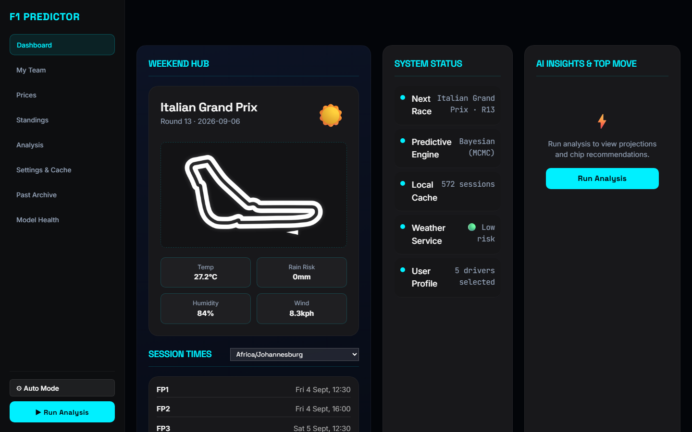
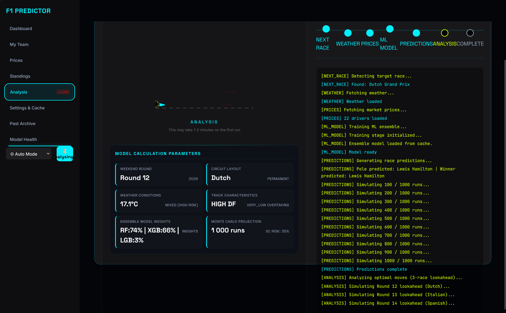
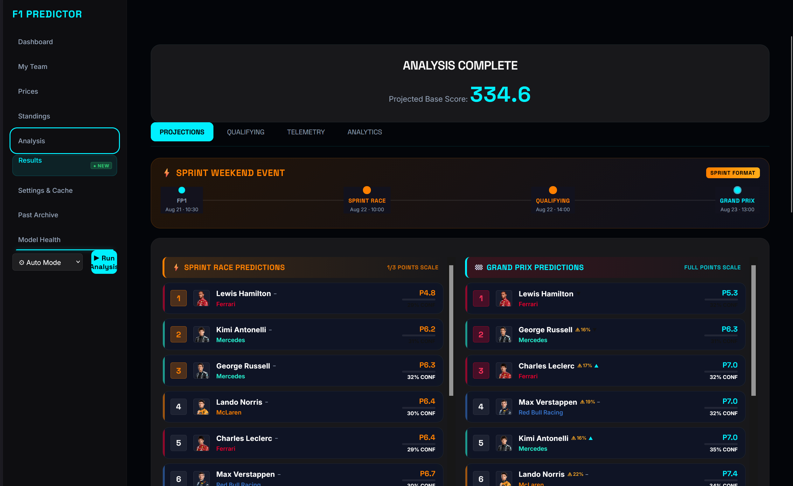
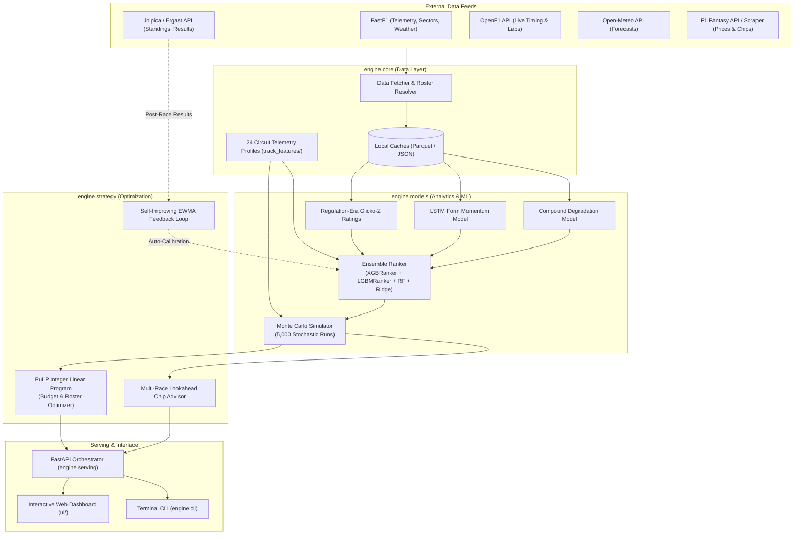

# 🏎️ F1 Fantasy Prediction Engine

[](LICENSE)
[](https://www.python.org/)
[](https://fastapi.tiangolo.com)
[](#testing--verification)
[](#quick-start)

An advanced, production-grade **Formula 1 Fantasy Prediction & Lineup Optimization Engine**. Powered by an ensemble of machine learning rankers, ground-effect regulation Glicko-2 ratings, LSTM momentum tracking, 54-dimensional ML telemetry features across 24 championship circuits, 5,000-run Monte Carlo stochastic simulations, and integer linear programming lineup optimization.

---

## 📸 Visual Showcase

<div align="center">
  <h3>Desktop Dashboard & Strategy Suite</h3>
  
</div>

<br/>

<div align="center">
  <table>
    <tr>
      <td width="50%">
        <h4 align="center">Race Predictions & Projected Delta</h4>
        
      </td>
      <td width="50%">
        <h4 align="center">Linear Programming Team Optimization</h4>
        
      </td>
    </tr>
  </table>
  <p><em>Responsive interface available across desktop, tablet (<a href="Screenshots/tablet.png">tablet.png</a>), and mobile (<a href="Screenshots/mobile.png">mobile.png</a>).</em></p>
</div>

---

## 🤖 The Story: 100% AI-Crafted, Vibe Coded & Rigorously Tested

> *"What happens when an engineering student pairs up with frontier AI models to tackle a complex motorsport optimization puzzle?"*

### 🎓 An Engineering Student's Weekend Passion Project
I am primarily an **engineering student**. Outside of university lectures, labs, and coursework, Formula 1 fantasy analytics became a hobby I picked up to explore the intersection of motorsport physics, data science, and mathematical optimization. 

### ⚡ Built Entirely With AI ("Vibe Coded")
This entire project was conceived, architected, implemented, and refactored **100% through human-AI co-piloting and "vibe coding"**. Rather than writing every routine by hand or sticking to trivial scripts, I wanted to explore the outer boundaries of what modern foundation models can achieve when guided by an inquisitive engineer:

- **Google Gemini**: Spearheaded large-scale codebase synthesis, complex multi-file architectural reorganizations, and holistic pipeline orchestration.
- **Anthropic Claude**: Guided nuanced mathematical formulation — including regulation-era Glicko-2 dynamics, LambdaMART pairwise ranking, integer linear programming via PuLP, and EWMA self-improvement loops.
- **Zhipu GLM**: Contributed to rapid algorithmic iteration, telemetry feature exploration, and modular utility scripts.

### 🛡️ "Vibe Coding" With Zero Compromise on Quality
"Vibe coding" often carries a stereotype of producing fragile, unverified scripts. For this project, **being AI-assisted did not mean cutting corners or compromising on quality** — in fact, it demanded even stricter engineering discipline:

- **Collaborative Human-AI Testing**: Every architectural layer went through intense adversarial review and verification loops. If an AI model proposed a change, it had to prove itself with reproducible evidence, rigorous math, and robust error handling.
- **Automated Contract Suite (45/45 Green)**: We engineered and maintained regression tests covering data-ingestion bounds, driver identity drift, fantasy points contracts, and UI asset serving.
- **Multi-Season Backtesting**: Every ranking ensemble was benchmarked against historical races (2022–2025) using time-series cross-validation to guarantee zero future data leakage.

This repository is living proof of the modern paradigm of software engineering: a solo engineering student directing frontier AI models to build a production-grade, highly specialized predictive system without sacrificing an ounce of code quality or scientific rigor.

---

### 1. 🏎️ 24 Championship Circuits & 54+ ML Telemetry Features
Every championship circuit (all 24 circuits on the calendar) is modeled using canonical telemetry profiles defined in [`track_features/`](track_features/). The ML ensemble uses a 54+ feature vector combining driver form, weather, and circuit physics:
- **Tire & Chassis Demands**: Lateral grip energy, longitudinal traction stress, asphalt micro/macro-abrasion, and degradation multipliers by compound (C1–C6).
- **Aero & Drag Dynamics**: Low, medium, high downforce setups, drag sensitivity, DRS delta impact, and telemetry speed trap benchmarks.
- **Circuit Environment & Chaos**: Safety Car / Virtual Safety Car baseline probabilities, pit lane transit time loss, elevation gradients, and overtaking difficulty indices.

### 2. 🤖 Machine Learning Ranking Ensemble
Replaces generic regressors with pairwise learning-to-rank algorithms tailored for motorsport grids:
- **`XGBRanker` & `LGBMRanker`**: Optimize LambdaMART objective functions across historical race finishes, grid positions, and practice telemetry deltas.
- **`RandomForestRegressor` + Meta-Estimator Stacking**: Blends tree predictions through a penalized `Ridge` meta-estimator to produce robust, variance-reduced point expectations.
- **Strict Leakage Prevention**: Enforces temporal isolation between historical training partitions and active-season test rounds.

### 3. 📈 Dynamic Ratings & Form Momentum
- **Ground-Effect Era Glicko-2**: Dual-rating system that separates driver skill from constructor car development curves since the 2022 regulation reset, preventing historical inertia from skewing modern predictions.
- **LSTM Form Momentum**: Recurrent neural network tracking recent form acceleration, capturing non-linear driver confidence and mid-season technical upgrade packages.

### 4. 🎲 Monte Carlo Engine & PuLP Budget Optimizer
- **5,000 Stochastic Iterations**: Simulates lap-1 incidents, safety cars, wet-weather transitions, mechanical retirements (DNF rate modeling), and overtaking difficulty per circuit.
- **Integer Linear Programming (PuLP / CBC)**: Computes the mathematically global optimal 5-driver + 2-constructor team within official fantasy budget caps ($100M+).
- **Strategic Chip Planning & 3-Race Lookahead**: Recommends optimal timing for *3X Booster*, *Limitless*, *Wildcard*, *No Negative*, *Extra DRS*, and *Autopilot* chips via dynamic programming transfer forecasts.

### 5. 🔄 Self-Improving Feedback Loop
- **Automated Post-Race Validation**: Pulls finalized FIA / Jolpica classification times post-race to compute error residual metrics (MAE, RMSE, Rank Correlation).
- **EWMA Bias Calibration**: Continuously updates constructor efficiency and driver bias factors to auto-correct drift prior to the next grand prix weekend.

---

## 📐 Architecture Dataflow



---

## 🚀 Quick Start

### 1. Automated Launchers

#### Windows
Double-click the desktop launcher:
```bat
F1 Fantasy.bat
```
*(Or run `RUN_CLI_Legacy.bat` for the classic terminal interface).*

#### Linux / macOS
Grant execution permissions and execute the startup shell script:
```bash
chmod +x run_app.sh
./run_app.sh
```

---

### 2. Manual Installation

```bash
# 1. Clone the repository
git clone https://github.com/Retr0-908/F1-Prediction-engine.git
cd F1-Prediction-engine

# 2. Set up virtual environment
python -m venv venv
# On Linux / macOS:
source venv/bin/activate
# On Windows:
.\venv\Scripts\Activate.ps1

# 3. Install dependencies
pip install -r requirements.txt

# 4. (Optional) Install Playwright Chromium for live fantasy market scraping
python -m playwright install chromium

# 5. Start the engine server & dashboard
python -m engine.serving.server
```

Open your browser at **`http://localhost:8000`** to access the strategy dashboard.

---

## 🔑 Configuration & API Keys (How to Get Them)

### ⚡ Out-of-the-Box: Zero API Keys Required!
The engine works **100% out of the box without requiring any API keys**. All core telemetry, historical results, and circuit forecasts are retrieved from free, open community APIs:
- **FastF1 Telemetry**: Directly accessible with zero authentication.
- **Jolpica / Ergast API**: Open motorsport classification database.
- **OpenF1**: Open-access timing and telemetry stream.
- **Open-Meteo**: Free weather forecasts with no API key or sign-up needed.

You can clone the repository, install dependencies, and run full predictions immediately without registering anywhere.

---

### 🍪 (Optional) F1 Fantasy Session Cookie (`F1_FANTASY_COOKIE`)
*Used to automatically sync your live F1 Fantasy team, remaining bank budget, and chip status from the official website into the optimizer.*

> [!TIP]
> If you omit this, the app still works completely! You can simply enter your team and budget into the web interface manually.

If you want automatic one-click syncing with your official fantasy account:
1. Log in to **[fantasy.formula1.com](https://fantasy.formula1.com/)** in your browser (Chrome, Edge, Brave, or Firefox).
2. Open Developer Tools by pressing **`F12`** (or right-click anywhere and click **Inspect**).
3. Switch to the **Application** tab (in Firefox, this is the **Storage** tab).
4. In the left sidebar, expand **Cookies** &rarr; select **`https://fantasy.formula1.com`**.
5. Locate the **`login-session`** cookie (or copy the entire `Cookie` string from any Network request header).
6. Create your local `.env` file by copying the template:
   ```bash
   cp .env.example .env
   ```
7. Open `.env` and paste your cookie string:
   ```env
   F1_FANTASY_COOKIE=login-session="your_cookie_here"
   ```
   *(Alternatively, run `python main.py --set-cookie` in the terminal to set it interactively).*

---

### ☀️ (Optional) OpenWeatherMap API Key (`OPENWEATHERMAP_API_KEY`)
*The engine uses **Open-Meteo** by default (free, no key needed). If you prefer to use OpenWeatherMap as a supplemental source:*

1. Visit [OpenWeatherMap Sign Up](https://home.openweathermap.org/users/sign_up) and create a free account.
2. Go to your **API Keys** dashboard tab: [home.openweathermap.org/api_keys](https://home.openweathermap.org/api_keys).
3. Copy your default 32-character API key.
4. Add it to your `.env` file:
   ```env
   OPENWEATHERMAP_API_KEY=your_32_character_api_key_here
   ```

---

## 🧪 Testing & Verification

Comprehensive test suites and validation utilities ensure high reliability:

```bash
# Run unit, contract, and pipeline integrity tests
python -m unittest discover engine/tools/tests

# Verify and warm telemetry / external API caches
python -m engine.tools.verify_caches

# Execute historical multi-season backtest (2023 - 2025)
# Windows:
BACKTEST.bat
# Linux / macOS:
./backtest.sh
```

---

## 📂 Project Structure

```
F1-Prediction-engine/
├── engine/                       # Core python engine package
│   ├── core/                     # API fetchers, config, filesystem paths, weather
│   ├── models/                   # ML rankers, Glicko-2, LSTM, tire, Monte Carlo
│   ├── strategy/                 # PuLP lineup optimizer, chip advisor, feedback loop
│   ├── analysis/                 # Historical backtester, race reporter, validators
│   ├── serving/                  # FastAPI web server and pipeline orchestrator
│   ├── cli/                      # Command-line interface application
│   └── tools/                    # Automated testing suites and cache utilities
├── ui/                           # Single-page web dashboard (HTML5, CSS3, JS)
├── track_features/               # Canonical telemetry profiles for all 24 Grand Prix circuits
├── Docs/                         # Engineering documentation & architecture plans
│   ├── MAINTENANCE.md            # Season handover, track updates & maintenance guide
│   ├── CONTRIBUTING.md           # Developer guidelines & contribution standards
│   └── REORGANIZATION_PLAN.md    # Architectural foundation documentation
├── Screenshots/                  # High-resolution application screenshots
├── F1 Fantasy.bat                # Windows native web launcher
├── run_app.sh                    # Unix native web launcher
├── requirements.txt              # Production Python package dependencies
└── LICENSE                       # GNU General Public License v3.0
```

---

## 📖 Documentation & Maintenance

- **Maintenance Guide**: Refer to [`Docs/MAINTENANCE.md`](Docs/MAINTENANCE.md) for annual driver market changes, calendar updates, adding new circuit telemetry files, and updating dependencies.
- **Contribution Standards**: Review [`CONTRIBUTING.md`](CONTRIBUTING.md) for pull request workflows, code style, and test coverage requirements.

---

## ⚖️ Legal Disclaimer & Fair Use Notice

This project is an **unofficial, non-commercial, open-source community tool** developed strictly for personal, educational, and analytical research purposes. 

- It is **not** associated, affiliated, authorized, endorsed by, or in any way officially connected with **Formula 1**, **Formula One Licensing B.V.**, **Formula One Management Ltd**, the **FIA (Fédération Internationale de l'Automobile)**, or **F1 Fantasy**.
- All official Formula 1 marks, team names, driver names, circuit names, logos, and related intellectual property are registered trademarks of Formula One Licensing B.V. or their respective owners.
- Driver headshot cutouts and constructor insignias displayed in the UI are low-resolution assets utilized strictly for nominative identification under **Fair Use** principles. No copyright infringement is intended.
- **Notice & Takedown**: If you are a copyright or trademark holder and request the removal or replacement of any specific media asset, please open a GitHub issue or contact the repository maintainer, and the asset will be promptly removed.

---

## 🙏 Acknowledgements & Data Sources

This open-source project is made possible through the generous data and tooling provided by the motorsport engineering and open-source community:

- **[FastF1](https://github.com/theOehrly/Fast-F1)**: Exceptional Python library for Formula 1 telemetry, session timing, and sector analysis.
- **[Jolpica-F1 / Ergast](https://github.com/jolpica/jolpica-f1)**: Community-maintained REST API preserving historical championship classifications and standings.
- **[OpenF1](https://openf1.org/)**: Real-time open telemetry and timing data feeds.
- **[Open-Meteo](https://open-meteo.com/)**: High-precision meteorological forecast APIs.
- **[PuLP & COIN-OR CBC](https://github.com/coin-or/pulp)**: Linear programming optimization engine.

---

## 📄 License

This project is licensed under the **GNU General Public License v3.0 (GPLv3)**.  
See the [`LICENSE`](LICENSE) file for the full license terms.

```
Copyright (C) 2024-2026 Retr0-908 & Contributors

This program is free software: you can redistribute it and/or modify
it under the terms of the GNU General Public License as published by
the Free Software Foundation, either version 3 of the License, or
(at your option) any later version.
```
